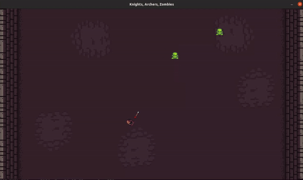
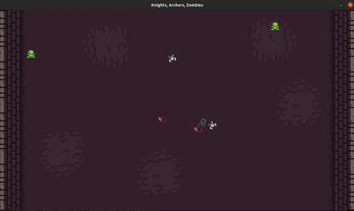

## Multi-Agent Reinforcement Learning (MARL) to master Knights Archers Zombies game

### Goal
In this project, our aim is to implement a Cooperative MARL model with the goal of mastering the KAZ game that involves multiple agents.

### Main files

- arguments.py: Stores all the variables and values of the hyper-parameter.
- env.py: Imports, initializes and pre-processes KAZ environment from PettingZoo library.
- agent.py: Selects actions according to the current state and epsilon value, and takes steps for each agent individually
- dqn.py: The DQN MARL algorithm
- replay_buffer.py: Stores the trajectories in the memory
- train.py: Trains the agents, updates replay buffer, calculates loss and updates the network.
- test_pettingzoo.py: Uses the optimum model to test on a fresh environment.
- demo.py: Captures the frame, records the progress, saves the video and allows us to watch them play

### Setting Up
1. Create the conda env required for running the project (you might have to change the cudatoolkit version for one which is compatible with your CUDA drivers) -
```
conda env create -f conda_env.yml
```

2. Running the training loop -
 - For Single Agent -
```
python train.py --device cuda --project_name <wand_project_name> --experiment_name <wand_experiment_name> --spawn_rate 20 --num_knights 0 --num_archers 1 --batch_size 512 --lr 0.0001 --network_update_freq 10 --sync_target_network_freq 1000 --eps_decay 0.0001
```

- For Multi-Agent -
```
python train.py --device cuda --project_name <wand_project_name> --experiment_name <wand_experiment_name> --spawn_rate 20 --num_knights 2 --num_archers 2 --batch_size 512 --lr 0.0001 --network_update_freq 10 --sync_target_network_freq 1000 --eps_decay 0.0001
```

Adjusting the ```--num_knights``` and ```--num_archers``` we can change the env setup

### Demo
Single agent



Multiple agents



---
### NYU Deep Learning Final Project
### Vaibhav Mathur (vm2134) and Harini Appansrinivasan (ha1642)
